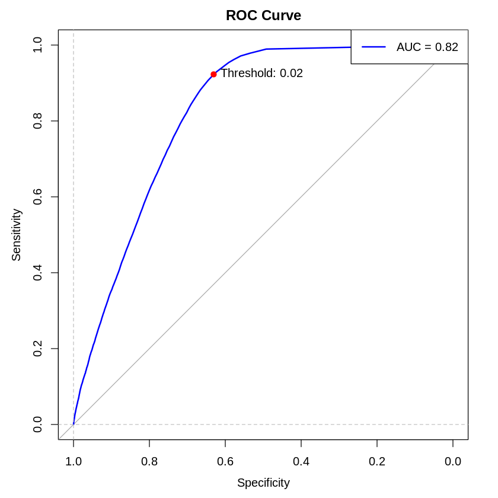

```{r, include=FALSE}
knitr::opts_chunk$set(echo = TRUE)
library(patchwork); library(GGally); library(ggplot2); library(car); library(mgcv); library(skimr); library(viridis)
library(psych); library(gridExtra); library(dplyr); library(MASS)
```

```{r, include=FALSE}
current_path <- getwd()
datasets_dir <- file.path(current_path, "datasets")
load(paste(datasets_dir, "train_reduced.RData", sep = "/"))
load(paste(datasets_dir, "unbalanced_train.RData", sep = "/"))
load(paste(datasets_dir, "unbalanced_test.RData", sep = "/"))
```

# "Doubt the data until the data leave no room for doubt." - Henri Poincaré

# Problem statement

The dataset contains the data of the clients of an Insurance company that has provided Health Insurance. Our goal is to analyze the relationship between the features and the probability of the customers buying a vehicle insurance. Now, in order to predict whether the customer would be interested in Vehicle insurance, we have information about demographics (gender, age, region code type), Vehicles (Vehicle Age, Damage), Policy ins(Premium, sourcing channel) etc.

Our client is an Insurance company that has provided Health Insurance to its customers. Now they need the help in building a model to predict whether the policyholders (customers) from the past year will also be interested in Vehicle Insurance provided by the company.

An insurance policy is an arrangement by which a company undertakes to provide a guarantee of compensation for specified loss, damage, illness, or death in return for the payment of a specified premium. A premium is a sum of money that the customer needs to pay regularly to an insurance company for this guarantee.

Building a model to predict whether a customer would be interested in Vehicle Insurance is extremely helpful for the company because it can then accordingly plan its communication strategy to reach out to those customers and optimize its business model and revenue.

# Data

We had three datasets to analyze 'train.csv', 'test.csv' and 'sample.csv'. Among these datasets we only analyzed the first one. The 'test.csv' dataset lacked the 'Response' variable and the 'sample.csv' file contained observations of this variable but one for one category, making them unusable.

Our dataset is composed of the following variables:

| Variable             | Definition                                                                                                                  | Type        |
|------------------|-------------------------------------|------------------|
| id                   | Unique ID for the customer                                                                                                  | Numeric     |
| Gender               | Gender of the customer                                                                                                      | Categorical |
| Age                  | Age of the customer                                                                                                         | Numeric     |
| Driving_License      | 0 : Customer does not have DL, 1 : Customer already has DL                                                                  | Binary      |
| Region_Code          | Unique code for the region of the customer                                                                                  | Categorical |
| Previously_Insured   | 1 : Customer already has Vehicle Insurance, 0 : Customer doesn't have Vehicle Insurance                                     | Binary      |
| Vehicle_Age          | Age of the Vehicle                                                                                                          | Categorical |
| Vehicle_Damage       | 1 : Customer got his/her vehicle damaged in the past. 0 : Customer didn't get his/her vehicle damaged in the past.          | Binary      |
| Annual_Premium       | The amount customer needs to pay as premium in the year                                                                     | Numeric     |
| Policy_Sales_Channel | Anonymized Code for the channel of outreaching to the customer ie. Different Agents, Over Mail, Over Phone, In Person, etc. | Categorical |
| Vintage              | Number of Days, Customer has been associated with the company                                                               | Numeric     |
| Response             | 1 : Customer is interested, 0 : Customer is not interested                                                                  | Binary      |

The first step is trying to get some insights about the dataset by plotting and analyzing the data. We present the barplots for the categorical variables and the density plots for the numerical ones.

The 'id' variable is just a discrete ordered variable with uniform distribution. Therefore, we just removed it from our analysis.

## Exploratory Data Analysis

### 'Response' variable

The proportion for the categories of the response variable are the following:

```{r}
# Pie chart of Response variable with percentages of the total observations. 
# Calculate the percentages
response_counts <- table(train_reduced$Response)
response_props <- round(prop.table(response_counts) * 100, 2)

# Create a data frame for the pie chart
pie_data <- data.frame(
  Response = factor(names(response_counts), labels = c("No", "Yes")),
  Count = as.numeric(response_counts),
  Label = paste0(response_props, "%")
)

# Create the pie chart
p0 <- ggplot(pie_data, aes(x = "", y = Count, fill = Response)) +
  geom_bar(stat = "identity", width = 1) +
  coord_polar("y", start = 0) +
  labs(x = "", y = "", fill = "Interest in Car Insurance") +
  theme_void() +
  theme(
    legend.position = "bottom",
    legend.text = element_text(size = 12),
    legend.title = element_text(size = 12), 
    text = element_text(size = 12)
  ) +
  geom_text(
    aes(y = Count / 2, label = Label),
    position = position_stack(vjust = 0.9),
    size = 8
  ) +
  scale_fill_discrete(labels = c("No", "Yes"))
p0
```

As we can see the dataset is unbalanced and the imbalance ratio is:

```{r}
props <- table(train_reduced$Response)
IR<-as.numeric(props[1]/props[2])
sprintf("IR: %f", IR)
```

This degree of imbalance is considered to be weak with respect to the reference level of 10 for slight imbalance, thus we decided to not perform any procedure to correct the imbalance.

### Numerical variables

```{r, fig.width=15, fig.height=15}
p2 <- ggpairs(train_reduced, 
              columns = c("Age", "Annual_Premium", "Vintage"),
              aes(color = Response),
              diag = list(discrete="barDiag", 
                          continuous = wrap("densityDiag", alpha=0.7)))
p2
```

The distribution of the Age variable with respect to the Response variable shows that the majority of the customers who are interested in car insurance are middle-aged (between 30 and 60 years old), which coincides with the age people are more likely to own a car. The customers not interested in acquiring a car insurance policy are mostly distributed among younger people and some middle-aged adults in their 50s. The ditribution is skewed to the right.

The plot for Annual Premium suggests that the costs of the car insurance policy is independent of the interest if the customers to buy the product. It has a highly right-skewed distribution, with most of the data concentrated on the lower end of the premium scale and a long tail extending to higher premium values. The lower tail shows a high values as a consequence of entry level health insurance policy as expected.

Since both Age and Annual Premium are skewed to the right, we considered to apply a logarithm transformation for both the variables.

```{r, fig.width=15, fig.height=15}
train_reduced$logAge <- log(train_reduced$Age)
train_reduced$logAnnual_Premium <- log(train_reduced$Annual_Premium)
p3 <- ggpairs(train_reduced, 
              columns = c("logAge", "logAnnual_Premium"),
              aes(color = Response),
              diag = list(discrete="barDiag", 
                continuous = wrap("densityDiag", alpha=0.7 )))
p3
```

The plot for Vintage shows a nearly uniform distribution, with a slight increase in frequency towards the middle range of the Vintage variable. It may not be significant in the explanation of the Response.

The variables show negligible linear correlation between them, which is clearly shown in the scatter plot and in the correlation coefficients.

### Categorical variables

```{r, fig.width=15, fig.height=9}
p9 <- ggplot(train_reduced, aes(x = Region_Code, fill = Response)) + 
  geom_bar(position = "dodge", color = "black") +
  labs(y = "Count", fill = "Response") +
  scale_x_discrete(breaks = function(x) x[seq(1, length(x), by = 10)]) +
  theme(
    text = element_text(size = 12),
    axis.text = element_text(size = 14)
  )


p14 <- ggplot(train_reduced, aes(x = Policy_Sales_Channel, fill = Response)) + 
  geom_bar(position = "dodge", color = "black") +
  labs(y = "Count", fill = "Response") +
  scale_x_discrete(breaks = function(x) x[seq(1, length(x), by = 20)]) +
  theme(
    text = element_text(size = 12),
    axis.text = element_text(size = 14)
  )
p_cat <- p9 + p14
p_cat##Should be clearer
```

Regarding the variable Region_Code, we can notice that the vast majority of the customers are from region 28. The customers from region 28 are also the ones who are most interested in car insurance. Almost half of the customers are distributed among regions 8, 28, 41, 46 accounting for \~47% of the total customers. Since this variable has a lot of labels with low frequency, we decided to consider only the major four ones mentioned above and an additional one with the remaining labels as a unique category.

Also in Policy_Sales_Channel, there are four categories more frequent than others: Channels 26, 124, 152 and 160 alone account for more than 80% of the customers. Channels 26 and 124 are the ones with the highest percentage of customers interested in the product. Only about 20% of the customers interested in the product are distributed in the rest of the channels of outreach. As we did for Region_Code, we grouped the remaining less frequent categories as one.

After the grouping:

```{r}
p10 <- ggplot(train_reduced, aes(x = Region_Reduced, fill = Response)) + 
  geom_bar(position = "dodge", color = "black") +
  labs(y = "Count", fill = "Response") +
  theme(
    text = element_text(size = 12),
    axis.text = element_text(size = 14)
  ) + 
  guides(fill = FALSE)
p15 <- ggplot(train_reduced, aes(x = Channels_Reduced, fill = Response)) + 
  geom_bar(position = "dodge", color = "black") +
  labs(y = "Count", fill = "Response") +
  theme(
    text = element_text(size = 12),
    axis.text = element_text(size = 14)
  ) + 
  guides(fill = FALSE)
p10+p15
```

Gender...

```{r}
p7 <- ggplot(train_reduced, aes(x = Gender, fill = Response)) + 
  geom_bar(position = "fill", color = "black") +
  labs(y = "Percentage", fill = "Response") +
  scale_y_continuous(labels = scales::percent_format()) +
  theme(
    text = element_text(size = 12),
    axis.text = element_text(size = 14)
  ) +
  guides(fill = FALSE)

p7
```

The last categorical variable is ID, which we won't consider for models, since it is a simple identifier of the customers. Hence it doesn't give any more information about the Response.

# MODELS

After exploring the data, now we proceed with the fitting and assessment of different models for binary classification. For training and testing the models we performed a static train/test split with 70% of train set and 30% of test set.

Il nostro scopo è capire quali variabili utilizzare e come utilizzarle. -nested models statico con assessment -stepAIC() con assessment -rifare tutto con log?? oppure ne facciamo 2 in parallelo

In order to understand which variables are more significant in the explanation of the response variable, we analyzed nested models with different combinations of selected explanatory variables.

## stepAIC

The first approach we used consists of using the function stepAIC() from the MASS package to find the best combination of predictors with respect to AIC. The stepAIC() function must be applied to the full model, which serves as the starting point for the variable selection process. We chose the 'both' direction, that considers both adding and removing variables from the model.

```{r}
# Drop columns Policy_Sales_Channel and Region_Code from unbalanced_train
unbalanced_train <- unbalanced_train[, !names(unbalanced_train) %in% c("Policy_Sales_Channel", "Region_Code")]

# Drop columns Policy_Sales_Channel and Region_Code from unbalanced_test
unbalanced_test <- unbalanced_test[, !names(unbalanced_test) %in% c("Policy_Sales_Channel", "Region_Code")]
```

```{r, eval = FALSE}
full_model <- glm(Response ~ Gender + Age + Driving_License + Previously_Insured + 
    Vehicle_Age + Vehicle_Damage + Annual_Premium + Vintage + 
    Channels_Reduced + Region_Reduced, data = unbalanced_train, family = binomial)
stepAIC(full_model, direction = 'both')
```

Performing the stepAIC function we can see that, as previously said, the variable Vintage is not useful for the model, since its almost uniform distribution. The stepAIC function stops when the ranking of models built by removing and adding one variable at a time has an AIC greater than the default model. Hence, this procedure doesn't allow us to obtain a simple model based on the Occam's razor. Consequentially we also implemented a procedure to obtain a reduced model based on idea of the stepAIC.

This procedure builds a ranking of variables, similar to the one of the stepAIC, meaning to create models by removing one variable at a time and sorting the variables by AIC. After that, we built nested models by adding one variable at a time based on the ranking of variables mentioned before.

```{bash}

Start:  AIC=144269.1
Response ~ Gender + Age + Driving_License + Previously_Insured + 
    Vehicle_Age + Vehicle_Damage + Annual_Premium + Vintage + 
    Channels_Reduced + Region_Reduced

                     Df Deviance    AIC
- Vintage             1   144233 144267
<none>                    144233 144269
- Annual_Premium      1   144250 144284
- Gender              1   144271 144305
- Driving_License     1   144278 144312
- Region_Reduced      4   144421 144449
- Vehicle_Age         2   144580 144612
- Age                 1   145993 146027
- Channels_Reduced    4   146476 146504
- Vehicle_Damage      1   148208 148242
- Previously_Insured  1   149056 149090

Step:  AIC=144267.2
Response ~ Gender + Age + Driving_License + Previously_Insured + 
    Vehicle_Age + Vehicle_Damage + Annual_Premium + Channels_Reduced + 
    Region_Reduced

                     Df Deviance    AIC
<none>                    144233 144267
+ Vintage             1   144233 144269
- Annual_Premium      1   144250 144282
- Gender              1   144271 144303
- Driving_License     1   144278 144310
- Region_Reduced      4   144421 144447
- Vehicle_Age         2   144580 144610
- Age                 1   145994 146026
- Channels_Reduced    4   146476 146502
- Vehicle_Damage      1   148208 148240
- Previously_Insured  1   149057 149089

Call:  glm(formula = Response ~ Gender + Age + Driving_License + Previously_Insured + 
    Vehicle_Age + Vehicle_Damage + Annual_Premium + Channels_Reduced + 
    Region_Reduced, family = binomial, data = unbalanced_train)

Coefficients:
          (Intercept)             GenderMale                    Age  
           -3.363e+00              8.284e-02             -2.644e-02  
   Driving_LicenseYes  Previously_InsuredYes   Vehicle_Age> 2 Years  
            1.106e+00             -3.855e+00              6.480e-01  
  Vehicle_Age1-2 Year      Vehicle_DamageYes         Annual_Premium  
            4.614e-01              1.975e+00              1.574e-06  
  Channels_Reduced124    Channels_Reduced152    Channels_Reduced160  
           -1.702e-01             -1.209e+00             -2.208e+00  
    Channels_Reduced0       Region_Reduced28       Region_Reduced41  
           -2.713e-01              2.573e-01              4.318e-01  
     Region_Reduced46        Region_Reduced0  
            1.484e-01              1.328e-01  

Degrees of Freedom: 266775 Total (i.e. Null);  266759 Residual
Null Deviance:	    198300 
Residual Deviance: 144200 	AIC: 144300

```

```{r}
best_model<-glm(Response ~ Gender + Age + Driving_License + Previously_Insured  + Vehicle_Age + Vehicle_Damage + Annual_Premium + 
    Channels_Reduced + Region_Reduced, data = unbalanced_train, family = binomial)
summary(best_model)
```

```{r}
exp(best_model$coefficients) 
```

These results suggest that:
 
* Male customers are 9% more interested in car insurance than female customers.
 
* There is a slight decrease in the odds of interest in the product with each year of increasing customer age. 

* Customers with a driver's license are 3 times more interested in the product than those without a driver's license.
 
* There is a dramatic decrease in the interest of the customers in the product for those who previously had their cars insured. The company should focus on improving its services because current policyholders lose their interest by 98% with respect to those without car insurance.
 
* The results show that customers with older cars show more interest than customers with new cars. Around 2 times for cars more than 2 years old compared to new cars.
 
* The interest in the Car Insurance Policy of the customers with health insurance who had their car damaged in the past is more than 7 times that of those who haven´t. This is expected and a variable the company should focus on to estimate the risk associated with these customers.
 
* The amount the customer needs to pay as a premium in the year doesn't seem to be associated with any increase or decrease in the odds of the event.
 
* There is more interest in the product, from ~14% to ~54% more interest, for customers from Regions 28, 41, 46, and 0 (combination of low frequent regions) with respect to Region 8.  
 
* The outreach Channel 26 (base category in the model) gets from 16% to 90% more interested customers in comparison with Channel 26. Channel 124 attracts a lot of clients as well and the company could attempt to increase its influence in this channel.
 
* The variable Vintage (number of days the customers have been associated with the company) was completely removed from the model because of low significance with respect to the AIC.

## Nested models

The first approach consists of adding variables one by one, starting from an empty model and proceeding until all the variables considered in the model. ##Comparison and model selection

```{r, echo=FALSE, collapse=TRUE}
library(mgcViz)
library(ROSE)
library(ggplot2)
library(mgcv)
library(dplyr)
library(skimr)
library(pROC)
library(caret)
library(purrr)
install.packages("ROSE")
#*LOAD THE DATA-----------------------------------------------------------------
# Define the path to the datasets
current_path <- dirname(rstudioapi::getActiveDocumentContext()$path)
datasets_dir <- paste(current_path,"datasets", sep = "/")
datasets_dir
#*--------------------------------------------------------------------
#*FUNCTIONS 
#*--------------------------------------------------------------------

# * This function assumes that `Policy_Sales_Channel` and `Region_Code` have been removed from the data
ranking_nested_models <- function(train_data, test_data, use_model = "glm", use_log = TRUE, use_splines = FALSE) {
  if(use_model == "glm" && use_log == TRUE){
    numeric_variables <- c("I(log(Age))", "I(log(Annual_Premium))")
  } else if (use_model == "glm" && use_log == FALSE){
    numeric_variables <- c("Age", "Annual_Premium")
  } else if (use_model == "gam" && use_log == TRUE && use_splines == TRUE){
    numeric_variables <- c("s(I(log(Age)))", "s(I(log(Annual_Premium)))")
  } else if (use_model == "gam" && use_log == TRUE && use_splines == FALSE){
    numeric_variables <- c("I(log(Age))", "I(log(Annual_Premium))")
  } else if (use_model == "gam" && use_log == FALSE && use_splines == TRUE){
    numeric_variables <- c("s(Age)", "s(Annual_Premium)")
  } else if (use_model == "gam" && use_log == FALSE && use_splines == FALSE){
    numeric_variables <- c("Age", "Annual_Premium")
  }

  #*VARIABLES IMPORTANCE RANKING --------------------------------------------------

  # Sort variables by importance wrt AIC
  # We remove one variable at a time and by decreasing AIC we get the most important variables
  # i.e., the variables that when removed increase the AIC is important
  predictors <- colnames(train_data)
  predictors <- predictors[predictors != 'Response']
  ranking_variables_models <- list()
  sum_variables <- paste(predictors, collapse = " + ")

  for (predictor in predictors){
    if (predictor == "Age"){
      formula_string <- paste("Response ~", sum_variables ,"- Annual_Premium -", predictor, "+", numeric_variables[2])

    } else if (predictor == "Annual_Premium"){
      formula_string <- paste("Response ~", sum_variables ,"- Age -", predictor, "+", numeric_variables[1])
    } else {
      formula_string <- paste("Response ~", sum_variables ,"- Age - Annual_Premium -", predictor, "+", paste(numeric_variables, collapse = " + "))

    }
    model_formula <- as.formula(formula_string)

    if(use_model == "glm"){
      model <- glm(model_formula, data = train_data, family = binomial)
    } else if (use_model == "gam"){
      model <- gam(model_formula, data = train_data, family = binomial)
    }

    ranking_variables_models[[predictor]] <- model
  }

  # Compute AIC values
  ranking_variables_aic_values <- sapply(ranking_variables_models, AIC)

  # Sort variables by AIC values
  df_ranking_variables_aic <- data.frame(VariableRemoved = predictors, AIC = ranking_variables_aic_values)
  # Assuming df is your DataFrame
  df_sorted_ranking_variables_aic <- df_ranking_variables_aic[order(df_ranking_variables_aic$AIC, decreasing=TRUE), ]
  # df_sorted_ranking_variables_aic

  #* NESTED MODELS ----------------------------------------------------------------
  variables_order <- df_sorted_ranking_variables_aic$VariableRemoved
  # variables_order
  variables_nested <- c()
  nested_models <- list()

  for (variable in variables_order) {
    if (variable == "Age"){
      variables_nested <- c(variables_nested, numeric_variables[1])
    } else if (variable == "Annual_Premium"){
      variables_nested <- c(variables_nested, numeric_variables[2])
    } else {
      variables_nested <- c(variables_nested, variable)
    }
    formula_string <- paste("Response", "~", paste(variables_nested, collapse = " + "))
    print(formula_string)  
    model_formula <- as.formula(formula_string)
    if(use_model == "glm"){
      model <- glm(model_formula, data = train_data, family = binomial)
    } else if (use_model == "gam"){
      model <- gam(model_formula, data = train_data, family = binomial)
    }
    
    nested_models[[variable]] <- model
  }

  # Compute AIC values
  raking_nested_models_aic_values <- sapply(nested_models, AIC)
  df_ranking_nested_models_aic <- data.frame(Model_Name = variables_order, AIC = raking_nested_models_aic_values)
  # df_ranking_nested_models_aic

  # Sort variables by AIC values
  df_sorted_ranking_nested_models_aic <- df_ranking_nested_models_aic[order(df_ranking_nested_models_aic$AIC, decreasing=TRUE), ]
  # df_sorted_ranking_nested_models_aic

  # Print the order of the variables to compare 
  # variables_order

  # COMPUTE AUC AND ACCURACY FOR EACH MODEL -------------------------------------

  # Apply models_assessment function to each model using map
  results_list <- map(nested_models, ~models_assessment(.x, test_data))

  # Compute AUC values
  auc_values <- list()
  accuracy_values <- list()
  tpr_values <- list()
  fpr_values <- list()
  tnr_values <- list()
  fnr_values <- list()
  precision_values <- list()
  threshold_values <- list()

  for (i in 1:length(results_list)){
    auc_values <- c(auc_values, as.numeric(results_list[[i]][1]))
    accuracy_values <- c(accuracy_values, as.numeric(results_list[[i]][2]))
    tpr_values <- c(tpr_values, as.numeric(results_list[[i]][3]))
    fpr_values <- c(fpr_values, as.numeric(results_list[[i]][4]))
    tnr_values <- c(tnr_values, as.numeric(results_list[[i]][5]))
    fnr_values <- c(fnr_values, as.numeric(results_list[[i]][6]))
    precision_values <- c(precision_values, as.numeric(results_list[[i]][7]))
    threshold_values <- c(threshold_values, as.numeric(results_list[[i]][8]))
  }

  result_df <- data.frame(
    Model_Name = df_ranking_nested_models_aic$Model_Name, 
    AIC = df_ranking_nested_models_aic$AIC,
    AUC = unlist(auc_values),
    Accuracy = unlist(accuracy_values),
    TPR = unlist(tpr_values),
    FPR = unlist(fpr_values),
    TNR = unlist(tnr_values),
    FNR = unlist(fnr_values),
    Precision = unlist(precision_values),
    Threshold = unlist(threshold_values)
  )

  # Return ranking of variables, | dataframe
  # results | dataframe
  # and nested models | list
  return(list(Ranking_Variables = df_sorted_ranking_variables_aic, Results = result_df, Models = nested_models))

}


#*FUNCTION TO PERFORM THE MODEL ASSESSMENT -------------------------------------
models_assessment <- function(model, test_data, save_plots = FALSE, plot_auc_name = NULL, plot_cmatrix_name = NULL){
  # Predict probabilities
  probabilities <- predict(model, newdata = subset(test_data, select = -Response), type = "response")

  # Compute ROC curve
  roc_curve <- roc(test_data$Response, probabilities)
  
  # Calculate AUC
  auc_score <- auc(roc_curve)

  # Find optimal threshold using Youden's J statistic
  youdens_j <- coords(roc_curve, "best", best.method = "youden")
  optimal_threshold <- youdens_j$threshold

  # Save ROC curve plot if specified
  if(save_plots){
    # Open a PNG file to save the ROC curve
    png(paste0(current_path, "/../plots/", plot_auc_name, ".png"),
        width = 10, height = 10,
        units = "in", res = 300)

    # Plot the ROC curve using plot.roc from the pROC package
    plot.roc(roc_curve, col = "blue", main = "ROC Curve", lwd = 2)

    # Add a point for the best threshold
    points(youdens_j$specificity, youdens_j$sensitivity, pch = 19, col = "red")

    # Adding a legend or text to mark the point
    text(youdens_j$specificity, youdens_j$sensitivity, labels = paste("Threshold:", round(optimal_threshold, 2)), pos = 4)

    # Add labels and legend
    abline(h = 0, v = 1, lty = 2, col = "gray")
    legend("topright", legend = paste("AUC =", round(auc(roc_curve), 2)), col = "blue", lwd = 2)

    # Close the PNG file
    dev.off()
  }

  # Obtain predicted classes based on the optimal threshold
  predicted_classes <- ifelse(probabilities > optimal_threshold, "Yes", "No")

  # Create the confusion matrix
  conf_matrix <- table(Actual = test_data$Response, Predicted = predicted_classes)

  conf_matrix_prop <- prop.table(conf_matrix, margin = 1)

  if(save_plots){
    # Plot confusion matrix
    p <- ggplot(data = as.data.frame(conf_matrix_prop), 
                aes(x = Actual, y = Predicted, fill = Freq)) +
      geom_tile(color = "white") +
      geom_text(aes(label = scales::percent(Freq)), vjust = 1) +
      scale_fill_gradient(low = "white", high = "blue") +
      labs(x = "Predicted", y = "Actual", fill = "Proportion") +
      theme_minimal()

    # Save the plot
    ggsave(paste0(current_path, "/../plots/", plot_cmatrix_name, ".png"),
           plot = p,
           width = 10, height = 10, dpi = 300)
  }

  # Calculate accuracy
  accuracy <- sum(diag(conf_matrix)) / sum(conf_matrix)

  # Calculate true positive rate
  tpr <- conf_matrix[2, 2] / sum(conf_matrix[2, ])

  # Calculate false positive rate
  fpr <- conf_matrix[1, 2] / sum(conf_matrix[1, ])

  # Calculate true negative rate
  tnr <- conf_matrix[1, 1] / sum(conf_matrix[1, ])

  # Calculate false negative rate
  fnr <- conf_matrix[2, 1] / sum(conf_matrix[2, ])

  # Calculate precision
  precision <- conf_matrix[2, 2] / sum(conf_matrix[, 2])

  return(list(auc_score = auc_score, accuracy = accuracy,
              tpr = tpr, fpr = fpr, tnr = tnr, fnr = fnr,
              precision = precision, optimal_threshold = optimal_threshold))

}

#*--------------------------------------------------------------------
#*RUN THE MODEL

```

```{r}
result_glm <- ranking_nested_models(unbalanced_train, unbalanced_test, use_model = "glm", use_log = FALSE, use_splines = FALSE)
```

```{r}
result_glm
```

Anova

```{r}

# Perform ANOVA

anova_values <- anova(result_glm$Models$Vintage, test = "Chisq")
anova_values
```

Observing the AIC and the anova test we noticed that there is not a significant decrease in the AIC or a significant improvement in deviance in the last three models, hence we decided to consider the nested model up to Region_Reduced.

```{r}
summary(result_glm$Models$Region_Reduced)
```

As we can see from the summary, all the variables have a p-value close to 0, hence they are all statistically significant

```{r}
result_glm_log <- ranking_nested_models(unbalanced_train, unbalanced_test, use_model = "glm", use_log = TRUE, use_splines = FALSE)
result_glm_log
```


This analysis shows that the best AIC in the model with the logarithm is worse than the model we chose for the glm without logarithm, hence we decided not to include the logarithm.

```{bash}
Family: binomial Link function: logit Formula: Response ~ Previously_Insured + Vehicle_Damage + s(Age) + Channels_Reduced +     Region_Reduced Parametric coefficients:                       Estimate Std. Error z value Pr(>|z|)     (Intercept)           -3.05287    0.04875 -62.625  < 2e-16 *** Previously_InsuredYes -3.85032    0.09558 -40.282  < 2e-16 *** Vehicle_DamageYes      2.01116    0.04089  49.189  < 2e-16 *** Channels_Reduced124   -0.19166    0.01699 -11.280  < 2e-16 *** Channels_Reduced152   -1.00391    0.03076 -32.639  < 2e-16 *** Channels_Reduced160   -1.65849    0.06397 -25.924  < 2e-16 *** Channels_Reduced0     -0.26664    0.01760 -15.147  < 2e-16 *** 
Region_Reduced28       0.26494    0.02651   9.994  < 2e-16 ***
Region_Reduced41       0.40953    0.03952  10.362  < 2e-16 *** 
Region_Reduced46       0.12364    0.03963   3.120  0.00181 ** 
Region_Reduced0        0.11996    0.02640   4.545 5.51e-06 ***
--- Signif. codes:  0 ‘***’ 0.001 ‘**’ 0.01 ‘*’ 0.05 ‘.’ 0.1 ‘ ’ 1 
Approximate significance of smooth terms:          
          edf Ref.df Chi.sq p-value     
s(Age) 8.323  8.754   2803  <2e-16 *** 
--- Signif. codes:  0 ‘***’ 0.001 ‘**’ 0.01 ‘*’ 0.05 ‘.’ 0.1 ‘ ’ 1 
R-sq.(adj) =  0.184   Deviance explained = 27.9% UBRE = -0.46369  Scale est. = 1         n = 266776
```

```{bash}
[1] "Response ~ Previously_Insured"
[1] "Response ~ Previously_Insured + Vehicle_Damage"
[1] "Response ~ Previously_Insured + Vehicle_Damage + s(Age)"
[1] "Response ~ Previously_Insured + Vehicle_Damage + s(Age) + Channels_Reduced"
[1] "Response ~ Previously_Insured + Vehicle_Damage + s(Age) + Channels_Reduced + Region_Reduced"
[1] "Response ~ Previously_Insured + Vehicle_Damage + s(Age) + Channels_Reduced + Region_Reduced + Vehicle_Age"
[1] "Response ~ Previously_Insured + Vehicle_Damage + s(Age) + Channels_Reduced + Region_Reduced + Vehicle_Age + s(Annual_Premium)"
[1] "Response ~ Previously_Insured + Vehicle_Damage + s(Age) + Channels_Reduced + Region_Reduced + Vehicle_Age + s(Annual_Premium) + Driving_License"
[1] "Response ~ Previously_Insured + Vehicle_Damage + s(Age) + Channels_Reduced + Region_Reduced + Vehicle_Age + s(Annual_Premium) + Driving_License + Gender"
[1] "Response ~ Previously_Insured + Vehicle_Damage + s(Age) + Channels_Reduced + Region_Reduced + Vehicle_Age + s(Annual_Premium) + Driving_License + Gender + Vintage"


Setting levels: control = No, case = Yes
Setting direction: controls < cases
Setting levels: control = No, case = Yes
Setting direction: controls < cases
Setting levels: control = No, case = Yes
Setting direction: controls < cases
Setting levels: control = No, case = Yes
Setting direction: controls < cases
Setting levels: control = No, case = Yes
Setting direction: controls < cases
Setting levels: control = No, case = Yes
Setting direction: controls < cases
Setting levels: control = No, case = Yes
Setting direction: controls < cases
Setting levels: control = No, case = Yes
Setting direction: controls < cases
Setting levels: control = No, case = Yes
Setting direction: controls < cases
Setting levels: control = No, case = Yes
Setting direction: controls < cases
 


$Ranking_Variables
                      VariableRemoved      AIC
Previously_Insured Previously_Insured 147581.0
Vehicle_Damage         Vehicle_Damage 146894.0
Age                               Age 145969.8
Channels_Reduced     Channels_Reduced 144142.0
Region_Reduced         Region_Reduced 143040.0
Vehicle_Age               Vehicle_Age 142960.3
Annual_Premium         Annual_Premium 142937.2
Driving_License       Driving_License 142908.0
Gender                         Gender 142903.5
Vintage                       Vintage 142874.9
$Results
           Model_Name      AIC       AUC  Accuracy       TPR       FPR
1  Previously_Insured 155905.7 0.7585627 0.5786343 0.9972279 0.4801025
2      Vehicle_Damage 150595.1 0.7890232 0.6372613 0.9781790 0.4105761
3                 Age 144890.1 0.8417453 0.6732614 0.9481129 0.3653056
4    Channels_Reduced 143278.1 0.8501295 0.6979700 0.9226669 0.3335594
5      Region_Reduced 143075.8 0.8510111 0.6959058 0.9281399 0.3366812
6         Vehicle_Age 142992.3 0.8515785 0.7005327 0.9223115 0.3305872
7      Annual_Premium 142932.1 0.8521367 0.6972178 0.9274291 0.3350854
8     Driving_License 142901.6 0.8522854 0.6881215 0.9404364 0.3472832
9              Gender 142874.9 0.8522166 0.6935268 0.9337551 0.3401819
10            Vintage 142876.7 0.8522134 0.6942615 0.9326889 0.3391945
         TNR         FNR Precision Threshold
1  0.5198975 0.002772052 0.2256824 0.1131638
2  0.5894239 0.021821025 0.2505462 0.1435224
3  0.6346944 0.051887128 0.2669615 0.1045971
4  0.6664406 0.077333144 0.2796123 0.1229755
5  0.6633188 0.071860118 0.2789277 0.1207088
6  0.6694128 0.077688535 0.2813408 0.1290902
7  0.6649146 0.072570901 0.2797299 0.1225083
8  0.6527168 0.059563580 0.2753533 0.1140271
9  0.6598181 0.066244936 0.2780612 0.1189352
10 0.6608055 0.067311110 0.2784155 0.1193174
$Models
$Models$Previously_Insured
Family: binomial 
Link function: logit 
Formula:
Response ~ Previously_Insured
Total model degrees of freedom 2 
UBRE score: -0.4155933     
$Models$Vehicle_Damage
Family: binomial 
Link function: logit 
Formula:
Response ~ Previously_Insured + Vehicle_Damage
Total model degrees of freedom 3 
UBRE score: -0.4354999     
$Models$Age
Family: binomial 
Link function: logit 
Formula:
Response ~ Previously_Insured + Vehicle_Damage + s(Age)
Estimated degrees of freedom:
8.41  total = 11.41 
UBRE score: -0.4568848     
$Models$Channels_Reduced
Family: binomial 
Link function: logit 
Formula:
Response ~ Previously_Insured + Vehicle_Damage + s(Age) + Channels_Reduced
Estimated degrees of freedom:
8.24  total = 15.24 
UBRE score: -0.4629275     
$Models$Region_Reduced
Family: binomial 
Link function: logit 
Formula:
Response ~ Previously_Insured + Vehicle_Damage + s(Age) + Channels_Reduced + 
    Region_Reduced
Estimated degrees of freedom:
8.32  total = 19.32 
UBRE score: -0.4636857     
$Models$Vehicle_Age
Family: binomial 
Link function: logit 
Formula:
Response ~ Previously_Insured + Vehicle_Damage + s(Age) + Channels_Reduced + 
    Region_Reduced + Vehicle_Age
Estimated degrees of freedom:
8.21  total = 21.21 
UBRE score: -0.4639986     
$Models$Annual_Premium
Family: binomial 
Link function: logit 
Formula:
Response ~ Previously_Insured + Vehicle_Damage + s(Age) + Channels_Reduced + 
    Region_Reduced + Vehicle_Age + s(Annual_Premium)
Estimated degrees of freedom:
8.21 7.68  total = 28.89 
UBRE score: -0.4642244     
$Models$Driving_License
Family: binomial 
Link function: logit 
Formula:
Response ~ Previously_Insured + Vehicle_Damage + s(Age) + Channels_Reduced + 
    Region_Reduced + Vehicle_Age + s(Annual_Premium) + Driving_License
Estimated degrees of freedom:
8.19 7.70  total = 29.88 
UBRE score: -0.4643386     
$Models$Gender
Family: binomial 
Link function: logit 
Formula:
Response ~ Previously_Insured + Vehicle_Damage + s(Age) + Channels_Reduced + 
    Region_Reduced + Vehicle_Age + s(Annual_Premium) + Driving_License + 
    Gender
Estimated degrees of freedom:
8.17 7.72  total = 30.89 
UBRE score: -0.4644388     
$Models$Vintage
Family: binomial 
Link function: logit 
Formula:
Response ~ Previously_Insured + Vehicle_Damage + s(Age) + Channels_Reduced + 
    Region_Reduced + Vehicle_Age + s(Annual_Premium) + Driving_License + 
    Gender + Vintage
Estimated degrees of freedom:
8.17 7.72  total = 31.89 
UBRE score: -0.4644318  
```

Trying to fit the model with gam and adding a spline for Age variable, we noticed that not only the AIC improves, but the expected degrees of freedom for the Age are significantly high, hence, so far, the best model seems to be the one using gam with splines on Age.

```{r}
library(arm)
# Get predicted values from the model
predicted_values <- predict(result_glm$Models$Region_Reduced, unbalanced_test, type = "response", threshold = result_glm$Results$Threshold[5])
 #?predict
# Calculate residuals
residuals <- residuals(result_glm$Models$Region_Reduced, type = "deviance", threshold = result_glm$Results$Threshold[5])
 
# Take the indexes for the predictions with probabiliies greater or equal than the optimal threshold
#best_model_indexes <- predicted_values >= 0.14
 
# Plot the binned residuals
arm::binnedplot(predicted_values[best_model_indexes], residuals[best_model_indexes])
```


### The best overall

---plots of the gcVIZ library---

```{r}
# select the commands that actually convey relevant information
gam_sampledViz <- getViz(gam_sampled)
print(plot(gam_sampledViz, allTerms = T), pages = 1)
plot(gam_sampledViz)

pl <- plot(gam_sampledViz, allTerms = T) + l_points() + l_fitLine(linetype = 3) + l_fitContour() + 
      l_ciLine(colour = 2) + l_ciBar() + l_fitPoints(size = 1, col = 2) + theme_get() + labs(title = NULL) #+ 
      # l_dens(type = "cond")
print(pl, pages = 1)
```

#### Binned residuals, VIF, Anova

---for anova and vif we only need to compute that for the best model or the full model---

```{r}
vif(result_glm$Models$Driving_License)
```

Through the vif function we can see that there is no sign of multicolinearity, since the variance inflation factors are very small for every variable.

Select one of the two blocks of code below

```{r}
library(arm)

# Get predicted values from the model
predicted_values <- predict(model, test_data, type = "response")

# Calculate residuals
residuals <- residuals(model, type = "deviance")

# Create partial residual plots for each predictor variable
par(mfrow = c(2, 2))  # Adjust the layout based on the number of predictor variables

for (var in colnames(test_data)) {
  if (var != "response") {
    partial_residuals <- residuals(model, type = "partial", terms = var)
    
    # Plot partial residuals
    plot(
      test_data[[var]], 
      partial_residuals,
      type = "p",
      xlab = var,
      ylab = "Partial Residuals",
      main = paste("Partial Residual Plot for", var)
    )
    
    # Calculate and plot binned residuals
    binned_residuals <- binned.resids(test_data[[var]], partial_residuals, nclass = 10)
    
    plot(
      binned_residuals$binned[, "xbar"],
      binned_residuals$binned[, "ybar"],
      type = "p",
      xlab = var,
      ylab = "Average Residual",
      main = paste("Binned Residual Plot for", var),
      ylim = c(-2, 2)
    )
  }
}

# Reset plotting parameters
par(mfrow = c(1, 1))
```

or

```{r}
library(arm)

# Get predicted values from the model
predicted_values <- predict(model_glm, test_data, type = "response")

# Calculate residuals
residuals <- residuals(model_glm, type = "deviance")

# Use binned.resids function
binned_residuals <- binned.resids(predicted_values, residuals, nclass = 50)$binned

# Print binned residuals
print(binned_residuals)

str(binned_residuals)

# Plot binned residuals
plot(
  range(binned_residuals[, 1]),
  range(binned_residuals[, 2], binned_residuals[, 6], -binned_residuals[, 6]),
  type = "n",  
  xlab = "Estimated Pr(Interest in Car Insurance)",
  ylab = "Average Residual",
  main = "Binned Residual Plot",
  # ylim = c(-2, 2)
)
abline(h = 0, col = "gray")
points(binned_residuals[,1], binned_residuals[,2], type = "p", col = "blue")
lines(binned_residuals[,1], binned_residuals[,6], type = "l", col = "blue")
lines(binned_residuals[,1], -binned_residuals[,6], type = "l", col = "blue")

```

Anova

```{r}

# Perform ANOVA

anova_values <- anova(result_glm$Models$Vintage, test = "Chisq")
anova_values
```

#### Coefficients

## RF

Due to our limited computational resources, we had to sample our dataset in order to fit a random forest model with 500 trees.

```{r}
sample <- unbalanced_train[sample(nrow(unbalanced_train), nrow(unbalanced_train)*0.6, replace = FALSE),]
```

```{r, eval = FALSE}
library(randomForest)
model_rf <- randomForest(Response ~ ., data = sample, importance = TRUE, ntree = 500)
print(model_rf)
```

```{bash}
Call:
 randomForest(formula = Response ~ ., data = sample, importance = TRUE,      ntree = 500) 
               Type of random forest: classification
                     Number of trees: 500
No. of variables tried at each split: 3

        OOB estimate of  error rate: 12.2%
Confusion matrix:
        No Yes  class.error
No  131627  72 0.0005467012
Yes  18233  68 0.9962843560
```

We can notice that the class error for the Yes category is very high, therefore we decided to use a threshold in order to avoid misclassification.

```{r}
# Predict probabilities
probabilities <- predict(model_rf, newdata = subset(unbalanced_test, select = -Response), type = "prob")[, "Yes"]
 
# Compute ROC curve
roc_curve <- roc(unbalanced_test$Response, probabilities)
 
# Calculate AUC
auc_score <- auc(roc_curve)
 
# Find optimal threshold using Youden's J statistic
youdens_j <- coords(roc_curve, "best", best.method = "youden")
optimal_threshold <- youdens_j$threshold
 
# Plot the ROC curve using plot.roc from the pROC package
plot.roc(roc_curve, col = "blue", main = "ROC Curve", lwd = 2)
 
# Add a point for the best threshold
points(youdens_j$specificity, youdens_j$sensitivity, pch = 19, col = "red")
 
# Adding a legend or text to mark the point
text(youdens_j$specificity, youdens_j$sensitivity, labels = paste("Threshold:", round(optimal_threshold, 2)), pos = 4)
 
# Add labels and legend
abline(h = 0, v = 1, lty = 2, col = "gray")
legend("topright", legend = paste("AUC =", round(auc(roc_curve), 2)), col = "blue", lwd = 2)
 
```



The model has an AUC of over 80% and the best threshold is 0.02.

```{r}
#*FUNCTION TO PERFORM THE MODEL ASSESSMENT -------------------------------------
random_forest_assessment <- function(model.rf, test_data){
  # Probabilities prediction of the positive class
  probabilities <- predict(model.rf, newdata = subset(test_data, select = -Response), type = "prob")[, "Yes"]

  # Compute ROC curve
  roc_curve <- roc(test_data$Response, probabilities)
  
  # Calculate AUC
  auc_score <- auc(roc_curve)

  # Find optimal threshold using Youden's J statistic
  youdens_j <- coords(roc_curve, "best", best.method = "youden")
  optimal_threshold <- youdens_j$threshold

  # Save ROC curve plot if specified

  # Obtain predicted classes based on the optimal threshold
  predicted_classes <- ifelse(probabilities > optimal_threshold, "Yes", "No")

  # Create the confusion matrix
  conf_matrix <- table(Actual = test_data$Response, Predicted = predicted_classes)

  conf_matrix_prop <- prop.table(conf_matrix, margin = 1)

  # Calculate accuracy
  accuracy <- sum(diag(conf_matrix)) / sum(conf_matrix)

  # Calculate true positive rate
  tpr <- conf_matrix[2, 2] / sum(conf_matrix[2, ])

  # Calculate false positive rate
  fpr <- conf_matrix[1, 2] / sum(conf_matrix[1, ])

  # Calculate true negative rate
  tnr <- conf_matrix[1, 1] / sum(conf_matrix[1, ])

  # Calculate false negative rate
  fnr <- conf_matrix[2, 1] / sum(conf_matrix[2, ])

  # Calculate precision
  precision <- conf_matrix[2, 2] / sum(conf_matrix[, 2])

  # Store the results in a data frame
  results_df <- data.frame(AUC = auc_score,
                          Accuracy = accuracy,
                          TPR = tpr, 
                          FPR = fpr,
                          TNR = tnr,
                          FNR = fnr,
                          Precision = precision,
                          Threshold = optimal_threshold)
  # Return the results
  return(results_df)

}

#*TRAIN THE RANDOM FOREST MODEL ------------------------------------------------

# Set the seed for reproducibility
set.seed(123)

# Train the random forest model
#rf_model <- randomForest(Response ~ ., data = unbalanced_train, ntree = 100)

# Assess the model using the test set and don't save the plots
rf_assessment <- random_forest_assessment(model.rf, test_data)

rf_assessment

```

```{bash}
AUC	Accuracy	TPR	FPR	TNR	FNR	Precision	Threshold
<auc>	<dbl>	<dbl>	<dbl>	<dbl>	<dbl>	<dbl>	<dbl>
0.8249842	0.6665879	0.922809	0.3693649	0.6306351	0.07719099	0.2595717	0.017

```


### Performances

| Models/Indexes | AUC  | Accuracy | TPR  | FPR  | TNR  | FNR  | Precision |
|----------------|------|----------|------|------|------|------|-----------|
| GLM            | 0.84 | 0.71     | 0.91 | 0.32 | 0.68 | 0.09 | 0.28      |
| GAM            | 0.85 | 0.70     | 0.93 | 0.34 | 0.66 | 0.07 | 0.28      |
| Random Forest  | 0.82 | 0.67     | 0.92 | 0.37 | 0.63 | 0.08 | 0.26      |


# Final conclusions

(skim)We observe that there are not missing values and that the Response variable has an imbalance rate of 7.15 (put code) so we don't need to act to fix that.
